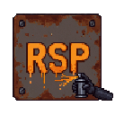

  

<h1 style="font-family: monospace; margin: 0">RUST SIGN PAINTER</h1>
  

    Professional automation tool for painting signs in the survival game Rust. 
     
    Load any image → smart color quantization → optimized brush strokes → fully automatic high-quality painting.
     
     
    <a href="https://github.com/lordchunder/rustsignpainter-app"><strong>Check the Documentation »</strong></a>
     
    <a href="https://github.com/lordchunder/rustsignpainter-app">Download for Free</a>
    •
    <a href="https://github.com/lordchunder/rustsignpainter-app/issues/new?template=bug_report.md">Report a Bug</a>
    •
    <a href="https://github.com/lordchunder/rustsignpainter-app/issues/new?template=feature_request.md">Request a Feature</a>
    
   <a href="https://www.awaiteddevelopments.com/contact">Contact</a>
   •
   <a href="mailto:support@awaiteddevelopments.com">Email Support</a>

---

## Download & Installation

1. Navigate to the [Releases](https://github.com/LordChunder/rustsignpainter-app/releases) tab on the right side of this
   GitHub page.
2. Under the **Latest** release, download the `rsp.exe` file.
3. Run the `.exe` (No installation required).

*Note: Windows Defender or other antivirus software may flag the file because it uses mouse/keyboard automation. This is
normal behavior for macro tools.*

---

## Free vs. Pro Tier

Rust Sign Painter is free to download and use forever, but the free tier has built-in limitations. Upgrading to Pro
unlocks the full potential of the rendering engine for highly detailed, photorealistic signs.

| Feature            | Free Tier      | Pro Tier             |
|:-------------------|:---------------|:---------------------|
| **Max Colors**     | Up to 8 Colors | **Up to 64 Colors**  |
| **Hardware Delay** | Capped at 50ms | **Unlimited (0ms)**  |
| **Color Delay**    | Capped at 0.5s | **Unlimited (0.0s)** |
| **Updates**        | Basic          | **Priority**         |

### How to Upgrade to Pro

1. Purchase a lifetime license key at *
   *[awaiteddevelopments.com/rustsignpainter](https://www.awaiteddevelopments.com/rustsignpainter)**.
2. Open the application.
3. Click **Options → 🔑 Activate License...** in the top menu bar.
4. Enter your email and license key to instantly unlock Pro features.

*Note: Licenses are limited to one active device per user and can be transferred. Multiple devices simultaneously
require separate licenses.*

---

## Features

- **Broad Image Support**: PNG, JPG, JPEG, BMP, GIF, WebP, TIFF
- **Fast Quantization**: High-quality median-cut algorithm
- **Optional Dithering**: Floyd-Steinberg for smooth gradients
- **Advanced Path Optimization**: Run-length merging + boustrophedon scanning
- **Brush-Aware Painting**: Background-first logic with separate detail passes
- **Smart Rust Integration**: Automatic hex input and brush size control
- **Easy Screen Setup**: Drag-to-select canvas + click-to-pick fields with overlay
- **Live Progress HUD**: Real-time painting status
- **Keybinds**: CTRL-1 pause/resume, hold CTRL-2 emergency stop, top-left failsafe stop (move mouse)
- **Persistent Configuration**: Automatically saves all screen positions

---

## Quick Start

### 1. Load & Preview

- Click the preview area to load your image
- Select your sign type/size
- Choose your desired number of colors
- Enable dithering if needed
- Click **Preview Quantization**

### 2. Configure Positions

Open Rust’s sign editor, then:

- **Capture Canvas** → drag over the painting area
- **Capture Hex Field** → click the hex color input
- **Capture Brush Field** → click the brush radius input
- Save configuration

### 3. Paint

- Adjust Detail Step and Background Step (higher = faster)
- Click **Generate Plan**
- Click **Start Painting** and switch to Rust during the countdown

---

## Controls

| Action          | Hotkey / Button               |
|-----------------|-------------------------------|
| Pause / Resume  | **CTRL-1**                    |
| Emergency Stop  | **CTRL-2** (hold)             |
| Global Failsafe | Move mouse to top-left corner |

---

## Important Notice

This software is **not open source**. The repository is public for distribution and updates only.  
All rights reserved. Unauthorized copying, modification, or redistribution is prohibited.

---

## Disclaimer & Safety

This tool uses mouse and keyboard automation **only after you explicitly start painting**.  
Always test on low-value signs first. Facepunch has commented that sign painting tools will not result in anti-cheat
bans, though you use this at your own risk.

---

**Built for the Rust community** ❤️

Awaited Developments
